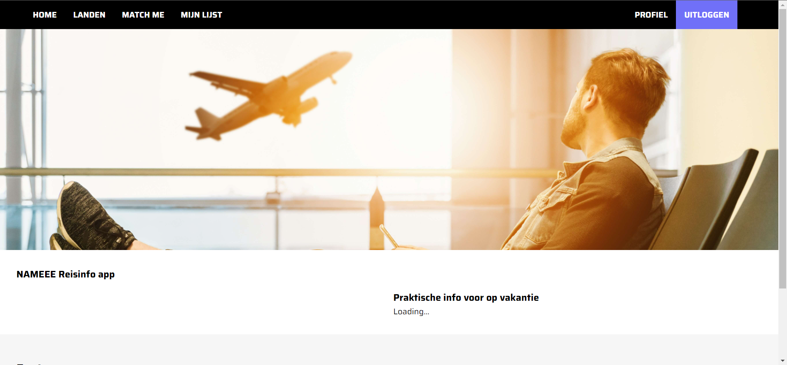
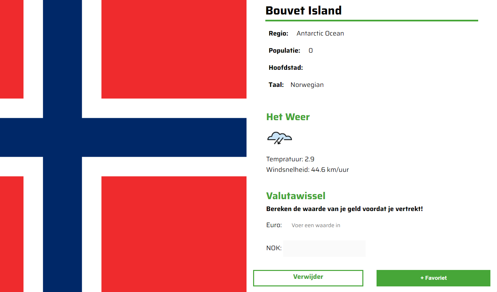

# Reisplanner :airplane:



Reisplanner is een matching applicatie voor vakantieliefhebber en mensen die interesse hebben op ander landen. Gebruiker wel een account maken om van  volgende functionaliteiten te genieten. Op deze website kunnen ze vanuit verschillende landen zoeken en ook filtreren op basis van een bepaalde voorkeur.

 Als de gebruiker een land heeft gevonden, kan ze die in het lijst opslaan. Bovendien is er per land een detailpagina met belangrijke informatie zoals het weer van dat land op dat moment en valuta wissel generator. Dit is handig wanneer voor een reis kan voorbereiden.

 #### Match me 
 

Match me is een tinder functionaliteit van reisplanner. Het is voor degene een risico wil nemen in hun vakantie. Als de gebruiker op die pagina komt, krijg die een willekeurige land zien. Als extra kunnen ze informatie over die land vinden. Verder kunnen gebruiker het land toevoegen in zijn eigen lijst.   
  

 ## Applicatie installeren
 Om aan dit project te werken moet je de volgende stappen doorlopen:

 ### Nodig:
- Npm
- Node.js
- Mongoose
- Express
- Mongodb Atlas en Mongodb Compass
- Ejs template engine

#### 1. Repository clonen
```
git clone https://github.com/K3A101/team-4-tech.git
```

#### 2. Packages installeren
Alle packages binnen dit applicatie  worden geinstalleerd.
```
npm install
```

#### 3. Server starten
```
npm run watch
```
## Collaborators 
- Sjoerd Reen 
- Michael Wilhelm
- Luc van der Heiden
- Keïsha Alexander
- Marijn de Bruin

## Database structuur
Hier is een voorpoefje van het database structuur voor het registreren functie en de  landen vanuit de 
 
 ## Wiki
 In de Wiki kan je informatie vinden over het progres, informatie  over en laat ik zien welk onderzoek ik heb gedaan. Ook vertel ik waarom ik bepaalde keuzes heb gemaakt.

## Code of Conduct
We volgen de richtlijnen van blok tech met de voorwaarde van MIT license. Verder is de code bruikbaar voor iedereen. 
 ## License

 De license voor de applicatie is MIT. Meer informatie over de license vind je [hier](https://github.com/Inevdhoven/blok-tech/blob/main/license).

